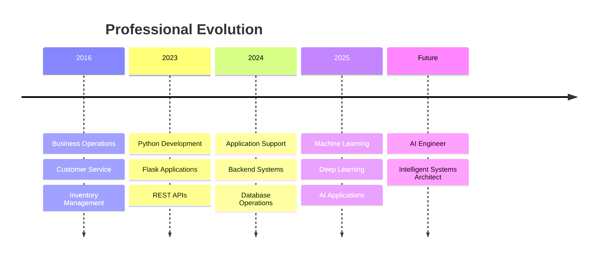
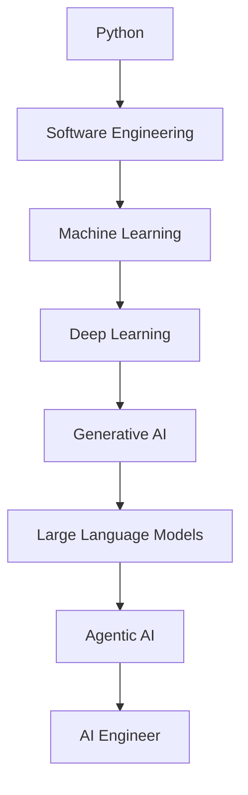

<div align="center">


<h1>⚡ Software Engineer → AI Engineer</h1>

<p>
Building intelligent software, exploring AI systems, and creating technology that solves real-world problems.
</p>


</div>

---

## 🚀 About Me

```yaml
Name: Antony Raj

Location: Tamil Nadu, India

Current Role: Software Engineer

Experience:
  - Software Development
  - Application Support
  - Technical Support
  - Business Operations

Specialization:
  - Python
  - Flask
  - REST APIs
  - SQL
  - MongoDB

Current Learning:
  - Machine Learning
  - Deep Learning
  - Large Language Models
  - Agentic AI

Goal:
  Become an AI Engineer and build intelligent systems
  that create real-world impact.
```

---

## 🧠 Engineering Journey



---

## ⚙️ Technology Stack

### Languages

<p align="center">

</p>

### Frameworks

<p align="center">

</p>

### Databases

<p align="center">

</p>

### Tools

<p align="center">

</p>

---

## 🌌 AI Roadmap



---

## 🎯 Featured Projects

### Candidate Assessment Platform

```yaml
Status:
  Active

Tech Stack:
  Python
  Flask
  SQLite

Features:
  Candidate Registration
  Assessment Engine
  Automated Scoring
  Analytics Dashboard
  Reporting System
```

---

### AI Recruitment Assistant

```yaml
Status:
  In Development

Tech Stack:
  Python
  LLMs
  Agentic AI

Planned Features:
  Resume Analysis
  Candidate Ranking
  AI Interviews
  Semantic Evaluation
  Feedback Generation
```

---

## 📊 Skill Matrix

| Skill            | Level                |
| ---------------- | -------------------- |
| Python           | ████████████████████ |
| Flask            | ██████████████████   |
| REST APIs        | ████████████████     |
| SQL              | ███████████████      |
| MongoDB          | █████████████        |
| Machine Learning | █████████            |
| Deep Learning    | ███████              |
| LLMs             | █████                |
| Agentic AI       | ███                  |

---

## 📈 GitHub Analytics

<div align="center">


</div>

<div align="center">


</div>

---

## 🎖️ Current Objectives

```text
✓ Build Production Flask Applications

✓ Master REST API Development

✓ Strengthen Database Design Skills

◉ Learn Machine Learning

◉ Learn Deep Learning

◉ Build LLM Applications

◉ Explore Agentic AI Systems

◉ Transition into AI Engineering
```

---

## 💡 Philosophy

> “Technology becomes valuable when it transforms ideas into real-world impact.”

---

## 🌍 Connect With Me

<p align="center">

<a href="https://github.com/YOUR_USERNAME">

</a>

<a href="https://linkedin.com/in/YOUR_LINKEDIN">

</a>

<a href="mailto:YOUR_EMAIL">

</a>

</p>

---

<div align="center">

# ⚡ Building Tomorrow's Intelligent Systems


</div>
