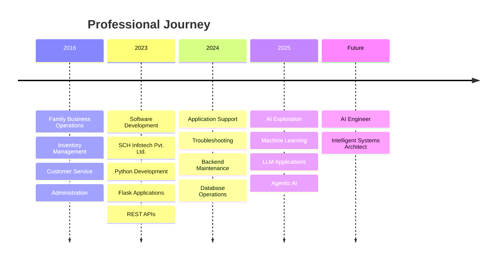
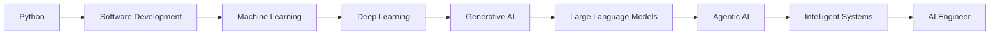

<div align="center">


# ⚡ SOFTWARE ENGINEER • PYTHON DEVELOPER • AI ENTHUSIAST


</div>

---

# 🖥️ AI COMMAND CENTER

```yaml
━━━━━━━━━━━━━━━━━━━━━━━━━━━━━━━━━━━━━━━━━━━━━━━━━━━━━━━

STATUS      : ONLINE

NAME        : Antony Raj

LOCATION    : Tamil Nadu, India

ROLE        : Software Engineer

SPECIALITY  : Python Development
              Flask Applications
              REST APIs
              Technical Support

MISSION     : Building intelligent software
              that solves real-world problems

NEXT TARGET : AI Engineer

━━━━━━━━━━━━━━━━━━━━━━━━━━━━━━━━━━━━━━━━━━━━━━━━━━━━━━━
```

---

# 🌟 ABOUT ME

I am a Software Engineer with experience in application development,
technical support, operations management, and customer-focused solutions.

My professional journey combines software engineering expertise with
real-world business operations experience, enabling me to build practical
and scalable solutions.

Currently, I am expanding my expertise in:

- 🤖 Machine Learning
- 🧠 Deep Learning
- 🔥 Large Language Models (LLMs)
- ⚡ Agentic AI Systems
- 🚀 Intelligent Automation

---

# 🛤️ CAREER JOURNEY



---

# ⚙️ TECH ARSENAL

## 💻 Programming Languages

<p align="center">

</p>

---

## 🧩 Frameworks & Libraries

<p align="center">

</p>

---

## 🗄️ Databases

<p align="center">

</p>

---

## 🛠️ Development Tools

<p align="center">

</p>

---

# 🧠 CURRENT LEARNING MATRIX

```text
Python                    ████████████████████ 95%

Flask                     ██████████████████   90%

REST APIs                 █████████████████    85%

SQL                       ████████████████     80%

MongoDB                   ███████████████      75%

Machine Learning          ████████████         60%

Deep Learning             █████████            45%

Large Language Models     ████████             40%

Agentic AI                ██████               30%
```

---

# 🤖 AI ROADMAP



---

# 🚀 FEATURED PROJECTS

## 🎯 Candidate Assessment Platform

### Overview

A web-based candidate evaluation platform designed to automate assessments,
evaluate responses, and generate reports.

### Features

✅ Candidate Registration

✅ Automated Scoring

✅ Reporting System

✅ HR Dashboard

✅ Candidate Tracking

### Technology Stack

```yaml
Backend:
  - Python
  - Flask

Database:
  - SQLite

Features:
  - Evaluation Engine
  - Reporting Module
  - Dashboard Analytics
```

---

## 🤖 AI Recruitment Platform

### Vision

Building intelligent hiring solutions using modern AI technologies.

### Planned Features

```yaml
Features:

  - AI Generated Questions

  - Semantic Evaluation

  - Candidate Ranking

  - Feedback Generation

  - Analytics Dashboard

  - LLM Integration

  - Agentic AI Workflows
```

---

# 📈 GITHUB ANALYTICS

<div align="center">


</div>

---

# 📊 CONTRIBUTION ACTIVITY

<div align="center">


</div>

---

# 🏆 PROFESSIONAL STRENGTHS

<table>
<tr>
<td>

### 💻 Development

- Python
- Flask
- REST APIs
- SQL
- MongoDB

</td>

<td>

### 🔧 Support

- Application Support
- Troubleshooting
- Testing
- Deployment

</td>
</tr>

<tr>
<td>

### 📊 Operations

- Inventory Management
- Documentation
- Administration
- Reporting

</td>

<td>

### 🤝 Soft Skills

- Communication
- Team Coordination
- Problem Solving
- Customer Service

</td>
</tr>
</table>

---

# 🎯 CURRENT OBJECTIVES

```yaml
2026 Goals:

  ✔ Master Python

  ✔ Build Advanced Flask Applications

  ✔ Learn Machine Learning

  ✔ Understand Deep Learning

  ✔ Explore LLM Architectures

  ✔ Build Agentic AI Systems

  ✔ Become an AI Engineer
```

---

# 🌍 PHILOSOPHY

> "Technology creates value when it solves real-world problems."

---

# ☕ FUN FACTS

```yaml
When Not Coding:

  - Learning AI Concepts

  - Exploring New Technologies

  - Building Personal Projects

  - Improving Communication Skills

  - Studying Intelligent Systems
```

---

# 📫 CONNECT WITH ME

<div align="center">

<a href="https://github.com/YOUR_USERNAME">

</a>

<a href="https://www.linkedin.com/in/YOUR_LINKEDIN">

</a>

<a href="mailto:YOUR_EMAIL">

</a>

</div>

---

# 🚀 FUTURE DESTINATION

```text
Software Engineer
        │
        ▼
Machine Learning
        │
        ▼
Deep Learning
        │
        ▼
Generative AI
        │
        ▼
Large Language Models
        │
        ▼
Agentic AI
        │
        ▼
AI Engineer
```

---

<div align="center">

## ⚡ BUILDING TOMORROW'S INTELLIGENT SYSTEMS ⚡


</div>
